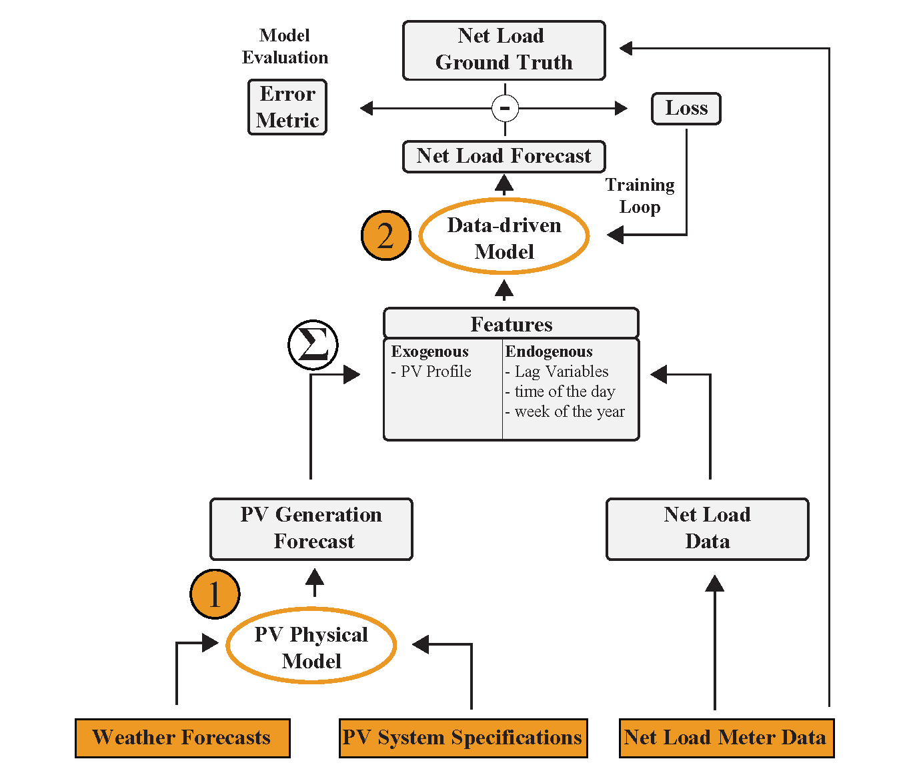

# Day-ahead net load forecasting with self-attention
)

This is the official repository for the paper: ["Day-ahead net load forecasting with self-attention: dealing with meter and
meta data unavailability by combining physical and data-driven models"] (✔️ Accepted to [International Energy Workshop](https://www.internationalenergyworkshop.org/meetings-16.html))

## Summary

### Introduction

The energy transition is under way and roof-top solar photovoltaics (PV) have the potential to make a significant contribution to a more decentralized and resilient energy system. However, as the adoption of roof-top PV grows, energy retailers and grid operators need new strategies for effectively integrating this variable and uncertain source of energy into the grid and their business models. As such, net load, defined as the total electrical load on a power system minus the generation from all sources of distributed energy resources (DERs), becomes increasingly important to forecast accurately, and well in advance. Accurate net load forecasting relies on the availability of high-quality data from various sources, including weather forecasts, historical and/or real-time data from smart meters, and PV system specification data. As data collection can be an expensive or even impossible endeavor, it is crucial for grid operators and energy retailers to have access to forecasting methods that use the available data efficiently. This motivates the core objective of this paper, namely to present a method for day-ahead net load forecasting that is robust to varying data availability.

### Motivation

  

<strong>Figure 1:</strong> Energy Community as a BRP in the European Electricity Market

### Model

  

<strong>Figure 2:</strong> Combination of PVWatts Physical Model and Data-Driven Transformer Neural Network.

