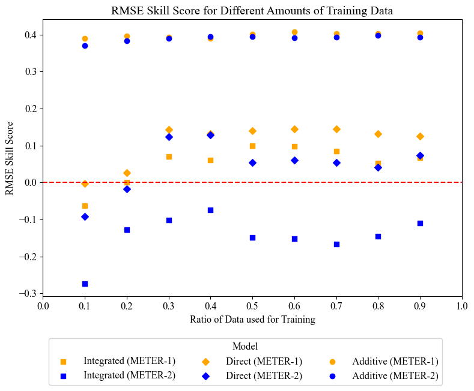

# Day-ahead net load forecasting with self-attention

This is the official repository for the paper: ["Day-ahead net load forecasting with self-attention: dealing with meter and
meta data unavailability by combining physical and data-driven models"] (✔️ Accepted to [International Energy Workshop](https://www.internationalenergyworkshop.org/meetings-16.html))

The paper & slides will be released here once presented at the conference.

## Summary

### Introduction

The energy transition is under way and roof-top solar photovoltaics (PV) have the potential to make a significant contribution to a more decentralized and resilient energy system. However, as the adoption of roof-top PV grows, energy retailers and grid operators need new strategies for effectively integrating this variable and uncertain source of energy into the grid and their business models. As such, net load, defined as the total electrical load on a power system minus the generation from all sources of distributed energy resources (DERs), becomes increasingly important to forecast accurately, and well in advance. 

### Motivation

Accurate net load forecasting relies on the availability of high-quality data from various sources, including weather forecasts, historical and/or real-time data from smart meters, and PV system specification data. As data collection can be an expensive or even impossible endeavor, it is crucial for grid operators and energy retailers to have access to forecasting methods that use the available data efficiently. This motivates the core objective of this paper, namely to present a method for day-ahead net load forecasting that is robust to varying data availability.

In the literature two approaches for net load forecasting have been proposed: indirect and direct. Existing work has presented mixed results about the efficacy of each. 

  

<strong>Figure 1:</strong> Energy Community part of the portofolio of a Retailer in the European Electricity Market

### Case Study

  

<strong>Figure 1:</strong> Energy Community part of the portofolio of a Retailer in the European Electricity Market

We differentiate between various data sharing scenarios, based on meter and meta data. These are shown below. 

In reality an Energy Community would opt for either METER-1 or METER-2 and the META scenario would be dictated by the fidelity of the data collection by the installer.

### Model

In this additive approach we combine the physical PV Watts model (calibrated for each system based on meta data) with a transformer neural network. 

  

<strong>Figure 2:</strong> Combination of PVWatts Physical Model and Data-Driven Transformer Neural Network.

### Results

  

<strong>Figure 4:</strong> Imbalance Costs vs. Training Data Ratio: Comparing Additive (ours) with Direct & Integrated Model.

  

<strong>Figure 5:</strong> RMSE Skill Score (w.r.t. 24h persistence) vs. Training Data Ratio: Comparing Additive (ours) with Direct & Integrated Model.

